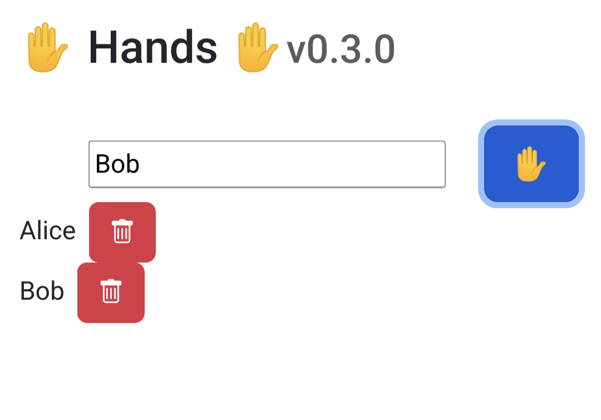

# ✋ Hands ✋

  

Hands is a simple, minimalist “raise your hand” web app to use with your friends and/or colleagues. Enter your name and click the ✋ button, it's that simple to use!

(It basically is Zoom's “raise your hand” feature in a standalone app, but at least you can use it in any context you like now.)

## Installation

* Clone the repository: `git clone https://github.com/sticmac/hands.git`
* Install the dependencies: `npm install`
* Run the app with `npm start`
  * Note: by default, the app runs on 8080 port. To specify a custom port, please specify it as an environment variable, e.g `PORT=3333 npm start`
